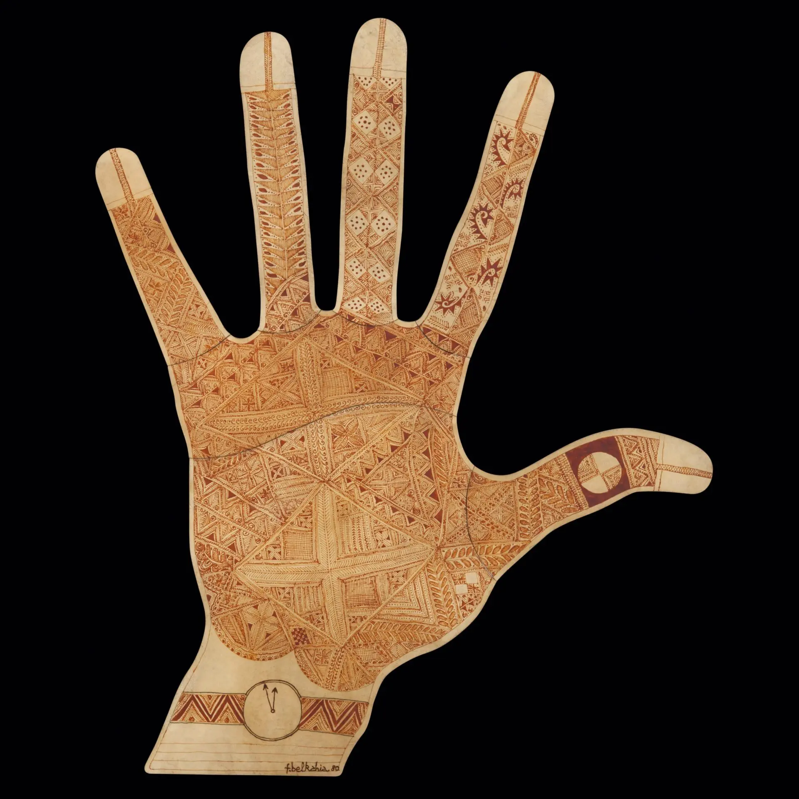

```{=html}
<div class="painting-section" style="border-top:none; margin-top:0; padding-top:0;">
  
  <div class="painting-caption">
    Farid Belkahia, <em>Main</em>, henné sur peau, 1980.
  </div>
</div>
```
