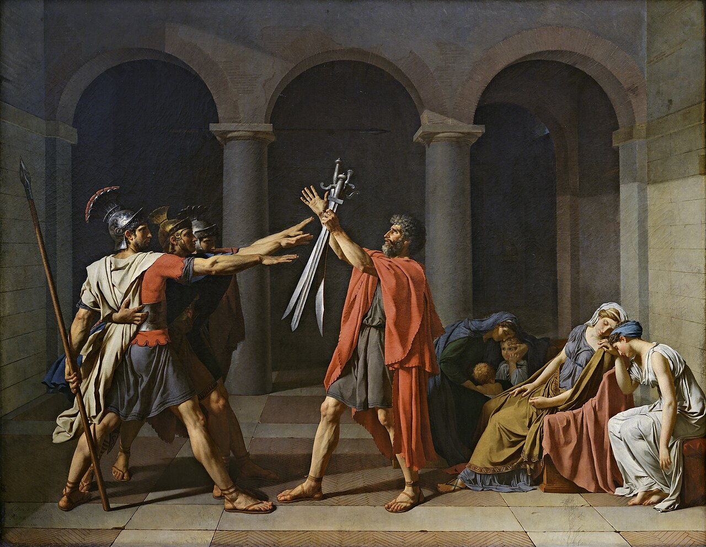

::: {.edu-entry}
### Ph.D. in Statistics and Machine Learning
**ESSEC Business School**, 2022 -- present

[Paris, France]{.location}
:::

::: {.edu-entry}
### Master of Science & Executive Engineering
**Mines-ParisTech (PSL University)**, 2018 -- 2022

[Paris, France]{.location}
:::

::: {.edu-entry}
### Master MVA (Mathématiques, Vision, Apprentissage)
**ENS Paris-Saclay**, 2022

[Paris, France]{.location}
:::

::: {.edu-entry}
### Master of Science in Statistical Science
**University of Oxford**, 2021

[Oxford, United Kingdom]{.location}
:::

```{=html}
<div class="painting-section">
  
  <div class="painting-caption">
    Jacques-Louis David, <em>Le Serment des Horaces</em>, 1784. Oil on canvas, Musée du Louvre, Paris.
  </div>
</div>
```
