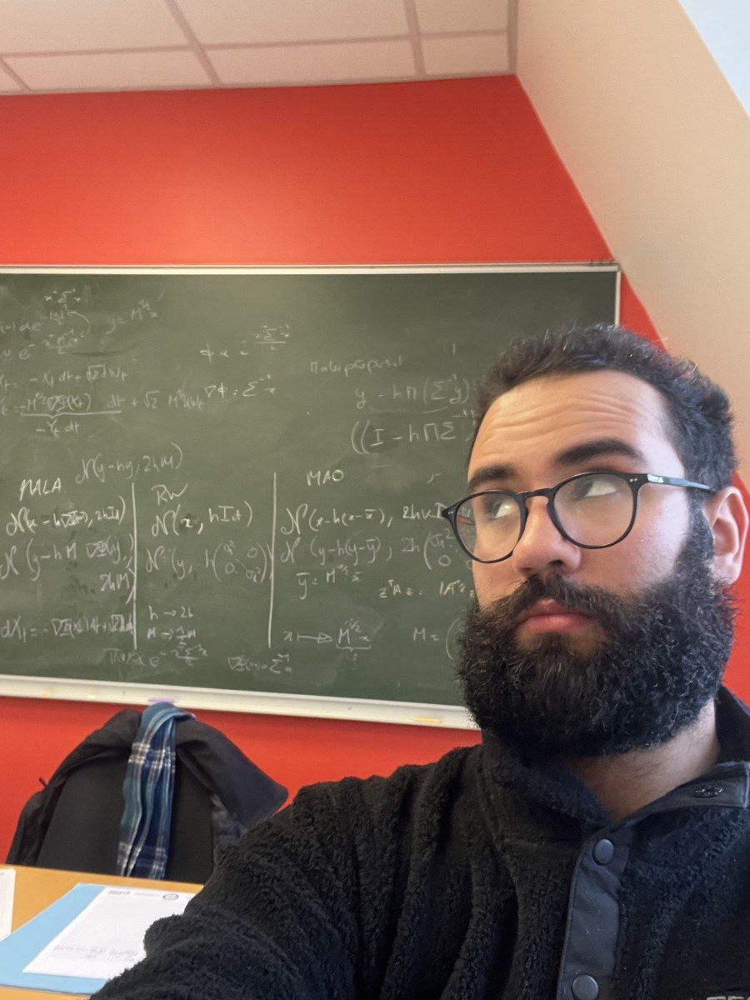
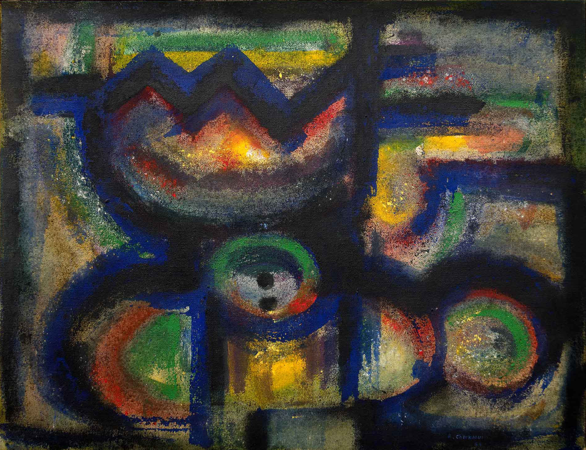

```{=html}
<div class="hero-name">
  <h1>Mehdi Khribch <span class="arabic-name">(المهدي خريبش)</span></h1>
  <p class="hero-subtitle">Postdoctoral Researcher in Statistics & Machine Learning</p>
  <div class="hero-line"></div>
</div>

<div class="about-card">
  <div class="about-container">
    <div class="about-sidebar">
      <div class="photo-frame">
        
      </div>
      <div class="about-links">
        <a href="mailto:el-mahdi.khribch@universite-paris-saclay.fr"><i class="bi bi-envelope"></i> Email</a>
        <a href="https://github.com/mehdi-khribch"><i class="bi bi-github"></i> GitHub</a>
        <a href="https://scholar.google.com/citations?user=bdvW1McAAAAJ"><i class="bi bi-mortarboard-fill"></i> Google Scholar</a>
        <a href="https://www.linkedin.com/in/el-mahdi-khribch/"><i class="bi bi-linkedin"></i> LinkedIn</a>
      </div>
    </div>
    <div class="about-main">
      <h2>About Me</h2>
      <p>I am a postdoctoral researcher funded by the ANR project <a href="https://sites.google.com/view/anrbackup/home">BACKUP</a>. I am based between the <a href="https://www.imo.universite-paris-saclay.fr/">Laboratoire de Math&eacute;matiques d'Orsay</a> (Universit&eacute; Paris-Saclay) and the <a href="https://www.lpsm.paris/">LPSM</a> (Sorbonne Universit&eacute; and Universit&eacute; Paris Cit&eacute;), working with <a href="https://perso.lpsm.paris/~castillo/">Isma&euml;l Castillo</a>, <a href="http://imo.universite-paris-saclay.fr/~gilles.blanchard/">Gilles Blanchard</a> and <a href="https://durandg12.github.io/">Guillermo Durand</a>. Until recently, I was a PhD candidate at <a href="https://www.essec.edu/">ESSEC Business School</a> in Paris, within the <a href="https://ido-department.essec.edu/home">Department of Information Systems, Data Analytics and Operations</a>, advised by <a href="https://pierrejacob.org/">Pierre E. Jacob</a> and <a href="https://pierrealquier.github.io/">Pierre Alquier</a>. I hold an Engineering Degree from <a href="https://www.minesparis.psl.eu/">Mines Paris&mdash;PSL University</a>, the <a href="https://www.master-mva.com/">Master MVA (Math&eacute;matiques, Vision, Apprentissage)</a> from <a href="https://ens-paris-saclay.fr/">ENS Paris-Saclay</a>, and an MSc in Statistical Science from the <a href="https://www.stats.ox.ac.uk/">Department of Statistics, University of Oxford</a>. Outside of research, I am passionate about literature, cinema, and art. See my <a href="blog.html">blog</a> to learn more.</p>
      <h2>Research Interests</h2>
      <p>My research lies at the intersection of Monte Carlo methods, statistical learning theory, and Bayesian nonparametrics. Much of my work so far has been on importance sampling and MCMC, in particular global proposal Monte Carlo methods and the analysis of their subgeometric convergence regimes. I am also interested in generalization guarantees, PAC-Bayesian theory, and robustness to model misspecification. These days, I am increasingly drawn to Bayesian nonparametrics, and to the question of how priors can adapt to the unknown structure of the data. The common thread is the development of scalable, theoretically principled algorithms for statistical learning.</p>
      <p>Feel free to get in touch.</p>
    </div>
  </div>
</div>

<div class="painting-section">
  
  <div class="painting-caption">
    Ahmed Cherkaoui, <em>Le couronnement</em>, 1964. Centre national des arts plastiques. Dépôt au Palais de la Porte Dorée, Paris.
  </div>
</div>
```
