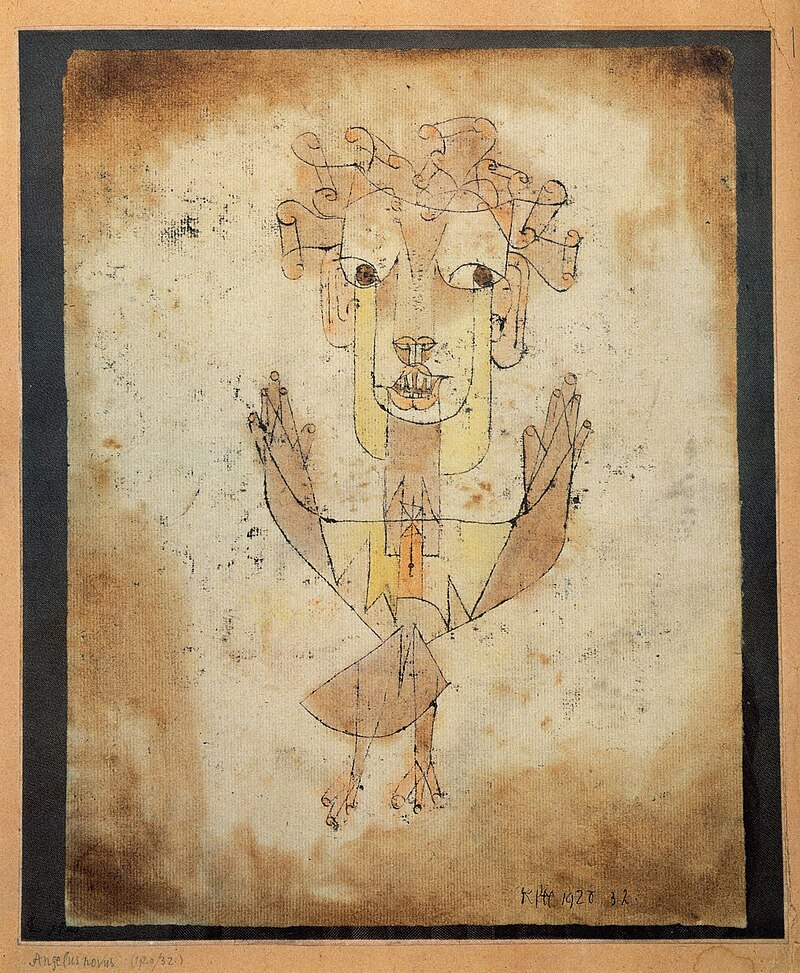
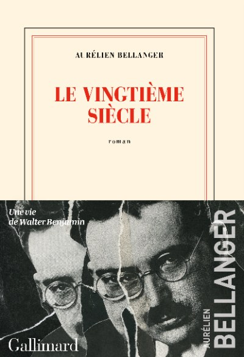
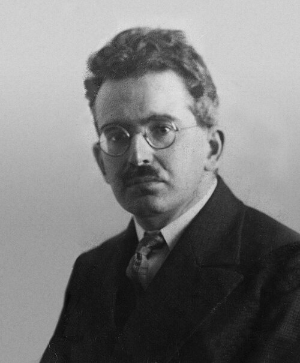
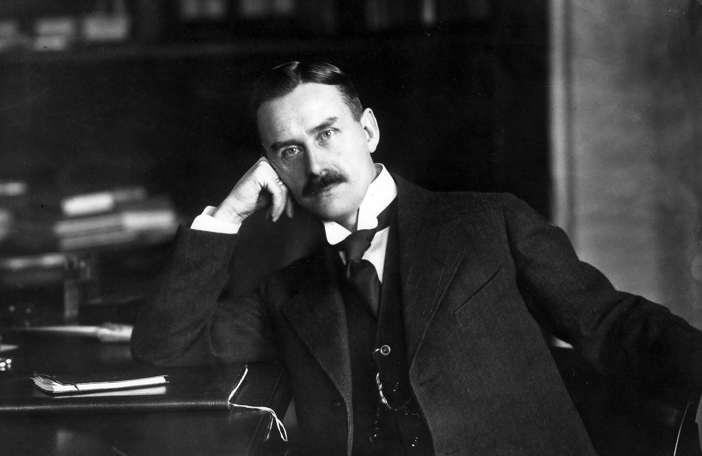

*A review of Aurélien Bellanger's [Le Vingtième Siècle](https://www.gallimard.fr/catalogue/le-vingtieme-siecle/9782072992551) (Gallimard, 2023): a novel in 49 fragments about Walter Benjamin, the catastrophe of the twentieth century, and the impossibility of writing a novel about either. Along the way: Adorno as the final boss of philosophy, Thomas Mann's secret music consultant, Rosalía as the reincarnation of the baroque, and the view from those who inherited modernity at an angle.*

---

There is a painting by Paul Klee called *Angelus Novus*. You almost certainly know this, and if you don't, you have certainly felt its logic operating on you without knowing its name. A small monoprint from 1920: part bird, part human, part angel, its hair made of floating scrolls, its wings tipped with fingers like tiny cathedral spires. The angel's eyes are enormous and staring, conveying both melancholy and astonishment. Its torso turns slightly left while its gaze drifts right, as though the creature cannot decide whether to flee or to stay. Walter Benjamin bought it in 1921, from Klee himself, and it became the most important object in his life, more important, one suspects, than any of the books he wrote, because the painting did what his books tried to do: it held the whole catastrophe in a single frozen gesture. A friend described him as overwhelmed with gratitude. One imagines the painting returned the favor, in its way.

{fig-align="center" width="55%"}

Benjamin's reading of it, in the ninth of his [*Theses on the Philosophy of History*](https://www.sfu.ca/~andrewf/CONCEPT2.html), composed in Paris in 1940 while the Wehrmacht was advancing through the Ardennes (which is to say, while things were not going well), is one of those passages that, once encountered, reorganizes the furniture of your mind permanently. The angel's face is turned toward the past. Where we see a chain of events, the angel sees one single catastrophe, piling wreckage upon wreckage. A storm blows from Paradise, caught in its wings with such violence that it can no longer close them. The storm propels the angel backward into the future, while the debris grows skyward. This, Benjamin wrote, is what we call progress. He intended it as a description, not a complaint, though the distinction, by 1940, was becoming difficult to maintain.

There is a particular vantage point from which this image resonates with an unexpected intimacy: the position of those who were present, at some oblique remove, at the making of the culture, flies on the wall of the salon where the logos that would yield the disaster was composed, without ever quite being invited to sit at the table. Benjamin and Adorno occupied a version of this position too: assimilated, cultivated, fluent in every register of a civilization that was preparing to expel them with bureaucratic thoroughness. Those of us from what is politely called the global south occupy another version of it, further from the table, closer to the door, but still in the room, still hearing the music. Benjamin's great unfinished [*Arcades Project*](https://www.hup.harvard.edu/books/9780674040274) traces how nineteenth-century Paris, that capital of the century, the civilization's shop window, ends in hell: the hell of commodity, of phantasmagoria, of a modernity that consumes its own premises. He saw this from inside the arcade; he was there, in the city, breathing its air, until the city and the civilization spat him out. The dominated were never even in the arcade. They were the raw material that made the shop window possible. But they could see the glass, and they could read what was written on it. The storm from Paradise does not reserve itself for those it names as enemies. It catches everyone in its wings.

Which brings me, by a route that I promise is not as circuitous as it seems, to [Aurélien Bellanger's *Le Vingtième Siècle*](https://www.gallimard.fr/catalogue/le-vingtieme-siecle/9782072992551) (Gallimard, 2023), a novel that is not really a novel, about a philosopher who never really wrote a novel, structured as 49 fragments that do not really cohere, and which is, for all these negations, one of the most thrilling literary experiences I have had in years.

{fig-align="center" width="35%"}

Bellanger, for the uninitiated, is one of the most intellectually formidable novelists working in France today, and one of the most cheerfully elitist, in a way that would be intolerable if it were not so obviously earned. He began his literary career in the orbit of Michel Houellebecq, publishing *Houellebecq écrivain romantique* in 2010, a programmatic essay that reads less like literary criticism than like a declaration of lineage. Houellebecq's shadow hangs over his early novels: the same cold sociological eye, the same ambition to write the Balzacian *Comédie humaine* of contemporary France, the same willingness to bore the reader into submission with technical detail until the boredom itself becomes a kind of revelation. But where Houellebecq retreats into cynicism, Bellanger presses forward into erudition. His novels (*La Théorie de l'information*, *L'Aménagement du territoire*, *Le Grand Paris*) are vast, architecturally precise machines for thinking about power, technology, and the French state. He writes the way a cartographer draws borders: with total command and the serene assumption that the territory being mapped is worth the effort. His France Culture appearances, and there are many, have the intensity of a man conducting an argument with very smart ghosts.

{fig-align="center" width="50%"}

## Forty-Nine Shards of a Broken Century

The novel opens with a provocation. "Le Groupe Benjamin tiendrait son nom du philosophe allemand Walter Benjamin," Bellanger writes on page 11: "The Benjamin Group would take its name from the German philosopher Walter Benjamin." The conditional tense, *tiendrait*, is doing all the work. Not "takes its name" but "would take its name," as though even the premise of the novel were held at arm's length, offered with a Gallic shrug, as if to say: this may or may not be what happened. And then, one page later, the stakes are raised to a pitch that makes the shrug feel like a feint:

> "Walter Benjamin serait un piège de cet ordre, un ultime remords de la modernité recroquevillée pour l'éternité à une portée de dé des lieux, variés, où celle-ci prétendait triompher ou mourir : fin de l'histoire hégélienne, société sans classes des marxistes, catastrophisme des enfants d'Hiroshima et d'Auschwitz."
>
> "Walter Benjamin would be a trap of this order, a final remorse of modernity curled up for eternity within a dice-throw of the various places where it claimed to triumph or die: the end of Hegelian history, the classless society of the Marxists, the catastrophism of the children of Hiroshima and Auschwitz." (p. 12)

That is a sentence you read twice, and then a third time, and then you set the book down and stare at the wall for a while.

{fig-align="center" width="40%"}

Bellanger's conceit is both simple and deranged: assemble 49 apocryphal documents, letters, academic papers, police reports, emails, poems, student theses, journal extracts, that collectively trace the life and afterlife of Walter Benjamin. There is no single narrator. There is no plot in the conventional sense. What there is, instead, is a literary *enquête*: somewhere in the Bibliothèque nationale de France, a lost manuscript is hidden, and after a poet commits suicide during a conference on Benjamin, a handful of scholars set out to find it. It is, on paper, the setup for an Umberto Eco novel. Bellanger, to his credit, does not write the Umberto Eco novel.

The number 49, by the way, is not arbitrary. It echoes a Talmudic reading of Psalm VIII: God opened to Moses the fifty gates of wisdom, withholding only the last. Benjamin died in September 1940, at the dawn of his fiftieth year. One gate short. The numerology is the kind of detail that Bellanger buries like a landmine for the attentive reader, the literary equivalent of an Easter egg, if Easter eggs could make you cry.

The fragments are disorienting by design. You encounter what appears to be an excerpt from a 1930s Marxist journal, then a contemporary email exchange between academics, then something that reads unmistakably like a pastiche of Gershom Scholem's correspondence style, then a police procedural. Bellanger has, and this is not a compliment one gives lightly, *un don* for imitating other people's styles. His ventriloquism is so assured that you begin to lose your footing, which is precisely the point. He pastiches Adorno, Scholem, Gide, Horkheimer with the kind of uncanny precision that makes you wonder whether the man is a novelist or a medium. I would love to ask him his opinion on pastiche itself, whether he considers it homage, theft, or a form of philosophical argument. Given the company he keeps, I suspect the answer is all three.

And the sentences, when they land, land hard. Consider this, from page 76:

> "Ce n'est plus la pièce, alors, que l'ange tient entre ses bras dévastés, c'est l'Europe, comme un dé, qui tombe sous ses yeux, c'est un monde, tout petit qui roule dans le néant."
>
> "It is no longer the painting, then, that the angel holds in its devastated arms; it is Europe, like a die, tumbling before its eyes; it is a world, very small, rolling into nothingness."

Or this, from page 158, which stopped me cold:

> "C'est à ce moment que j'ai compris quelque chose de décisif, et que j'ai fait instinctivement un pas en arrière : la mélancolie n'est pas un état de tristesse, c'est la vie inversée, mais tout aussi véritable."
>
> "It was at that moment I understood something decisive, and instinctively took a step back: melancholy is not a state of sadness; it is life inverted, but just as real."

The novel is, by any reasonable standard, absurdly erudite. It presupposes not merely familiarity with Benjamin's major works, the *Arcades Project*, the *Theses*, the essay on mechanical reproduction, but with the entire constellation of thinkers around him: Scholem, Adorno, Brecht, Arendt, Bataille. There are moments of wicked humor too. Page 240: "Le léninisme comme maladie infantile du dandysme, si vous voulez," which is to say, "Leninism as the infantile disorder of dandyism, if you will." Page 174, with magnificent nerve: "Et toute l'oeuvre de Spielberg n'est qu'une note de bas de page de *Lumières pour enfants*, ses écrits radiophoniques pour la jeunesse," or, "Spielberg's entire body of work is nothing but a footnote to *Enlightenment for Children*, his radio writings for young people." You are allowed to laugh. You are also allowed to wonder whether Bellanger is entirely wrong.

It is the kind of book that makes you feel as though you've wandered into a conversation that has been going on for a hundred years and someone has just handed you a glass of wine without pausing the sentence. This is a Bellanger specialty. He writes for the initiated the way a cathedral is built for the faithful: not to exclude, but because the architecture demands a certain commitment from those who enter.

## The Question the Novel Actually Asks

Here is what I think is the real engine of the book, the question that hums beneath its baroque surface: **why did Walter Benjamin never write a novel?**

This is not an idle question. Benjamin was, by any measure, one of the great prose stylists of the twentieth century. His sentences have the density of poetry and the momentum of narrative. He understood fiction: his essays on Kafka, on Proust, on the storyteller, are among the most penetrating things ever written about the art of narrative. He lived a life of extraordinary drama: exile, poverty, doomed love affairs, a desperate flight across the Pyrenees that ended in suicide at the Spanish border in September 1940. He had, in other words, both the talent and the material. And yet he never wrote a novel. Bellanger, characteristically, draws the parallel to Socrates: both philosophers of orality forced into silence by history, neither having produced the systematic written works of a Hegel or a Heidegger, both leaving behind a body of thought that had to be reconstructed from fragments by their disciples.

You can construct various explanations (temperament, circumstance, the perpetual financial precarity that meant every project was interrupted) but Bellanger's answer is more interesting, and more architectural. Benjamin could not write a novel because the novel, as a form, presupposes a certain faith in the coherence of experience, in the possibility of narrative resolution, that Benjamin's philosophy explicitly denied. The angel of history does not tell stories. It stares at wreckage. A novel requires you to turn your back on the debris and face the future; Benjamin's angel is blown backward into it, helplessly. To write a novel, you need to believe, even provisionally, even only for the duration of the writing, that events can be arranged into meaning. Benjamin believed the opposite: that the only honest arrangement is the fragment, the quotation, the constellation.

And so Bellanger gives us a novel made of fragments, a *mise-en-abyme* worthy of all the marbles. The form is the argument. The 49 pieces do not add up to a life of Benjamin; they add up to the impossibility of adding up, which is itself Benjamin's deepest insight about the century that killed him. As one of his characters puts it on page 147: "Mais ce que Benjamin m'a appris, c'est que la révolution censée nous libérer de la réification était déjà advenue, quand nous étions enfants, et dans les choses elles-mêmes," or: "What Benjamin taught me is that the revolution meant to free us from reification had already come to pass, when we were children, and in the things themselves." The revolution is not ahead of us. It already happened. We missed it. The things know.

## Adorno's Shadow, or: Le Boss de Fin de la Philosophie

You cannot talk about Benjamin without eventually talking about Theodor W. Adorno, and Bellanger knows this. The two men's intellectual friendship, intense, competitive, occasionally bitter, conducted largely by letter across the geography of European exile, is one of the great dramas of twentieth-century thought. Their correspondence, spanning nearly two decades and over a hundred surviving letters, ranks among the most significant intellectual exchanges of modernity: dense, detailed, alternately tender and cutting. Adorno was the only person who sustained an intimate intellectual relationship with Benjamin for that length of time. Each held the other's professional opinion in the highest esteem, which did not prevent them from being frequently exasperated with each other, a dynamic familiar to anyone who has had a best friend in academia.

{fig-align="center" width="45%"}

They shared a formation: bourgeois German Jews, steeped in the highest culture of a civilization that was about to turn on them with unimaginable violence. They were, in a sense, chased from heaven, not the theological heaven, but the cultural paradise of Weimar Germany, with its concert halls and seminar rooms and publishing houses. Their formative experience was the experience of having absorbed a civilization absolutely, its music, its philosophy, its literature, and then discovering that the civilization considered them expendable. The storm that blew Benjamin's angel backward was the same storm that scattered Adorno to California, where he found himself writing about jazz and the culture industry while palm trees swayed outside his window. Los Angeles was polite about it, but clearly baffled.

Bellanger's novel captures this with a line that could serve as the book's epigraph, from a footnote on page 12: "De là ce paradoxe que cette pensée profondément messianique aurait dirigé ses meilleures flèches contre la théorie du messianisme." "Hence the paradox that this profoundly messianic thought would have aimed its sharpest arrows against the very theory of messianism." Benjamin and Adorno believed in redemption, but only in a form that refused to arrive. Praxis, for them, was not a political program. It was a way of holding the contradiction open, of refusing to let the wound close into a scar that pretended to be whole.

In a [remarkable episode of *Le Souffle de la pensée* on France Culture](https://www.radiofrance.fr/franceculture/podcasts/le-souffle-de-la-pensee/l-essayiste-aurelien-bellanger-a-propos-de-la-dialectique-negative-de-theodor-w-adorno-6997294), Bellanger discusses Adorno's [*Dialectique négative*](https://www.payot-rivages.fr/payot/livre/dialectique-negative-9782228885058) with the kind of intensity that most people reserve for football matches or romantic betrayals. "Adorno, c'est le boss de fin de la philosophie," he announces, which sounds like something a teenager might say about a video game character, and is also, if you have spent time with the text, more or less correct. What comes through is Bellanger's deep affinity for Adorno's central move: the refusal of synthesis. Classical dialectics, Hegel's version, promises reconciliation: thesis, antithesis, synthesis, the whole tidy upward spiral. Adorno says no. The negative remains negative. The contradiction is not resolved.

Published in 1966, *Negative Dialectics* is, among other things, a sustained argument that philosophy must refuse to end, that any system achieving a satisfying resolution has already falsified reality. It is a philosophy of the remainder, the excess, the thing that cannot be absorbed into the concept. The wreckage stays wreckage. This is not pessimism; it is, Adorno insists, the only form of thinking adequate to a world that produced Auschwitz.

There is a further point here that Bellanger, a Frenchman steeped in what Americans would call "continental" philosophy, gestures at without quite spelling out. Adorno's project, and Benjamin's before him, represents a refusal of the clean separation between philosophy and its objects that the Anglo-American analytical tradition tends to enforce. In the Anglophone world, philosophy is a discipline with methods; it examines propositions, tests arguments, produces conclusions. For Benjamin and Adorno, philosophy is something that happens *to* you: it is inseparable from the texture of experience, from the particular weight of a sentence, from the color of a monoprint bought from Klee on a Tuesday in Munich. Bellanger stages this tension beautifully. One of the novel's funniest moments comes on page 56, where a character recalls that upon announcing her divorce, her only comment was: "qu'il avait toujours su que j'étais restée une *continentale*, et qu'avec un *analytique* comme lui, ça n'avait aucune chance de marcher..." That is: "He had always known I had stayed a *continental*, and that with an *analytical* like him, it never had a chance of working." A philosophy joke as divorce grounds. Only in Bellanger.

His novel, whether he intends it or not, stages a kind of reconciliation between these two traditions: its formal rigor, the architectural precision, the meticulous construction, borrows from the analytical impulse, while its content, fragmentary, embodied, resistant to summary, is irreducibly continental. It is, in this sense, a peace treaty between two philosophical traditions that have spent a century pretending the other doesn't exist.

Now here is where *Le Vingtième Siècle* and *Negative Dialectics* become, structurally, the same object seen from different angles. Adorno's great treatise is famously, almost programmatically, difficult to read in sequence. Its chapters resist linear progression. Its arguments circle back, contradict themselves at higher registers, refuse the comfortable arc of a thesis being proven. The experience of reading it is less like following a path than like moving through a space that keeps rearranging itself. Bellanger's 49 fragments produce exactly the same effect. They do not resolve into a harmonious whole. They remain jagged, contradictory, incomplete. The reader who arrives at page 432 expecting a synthesis will be disappointed. The reader who has understood what Bellanger is doing will recognize that the disappointment *is* the point.

## Thomas Mann's Music Consultant, or: Adorno as the Devil

There is a further connection worth drawing here, one that loops back beautifully to the question of the novel. When Adorno was in California exile, he became Thomas Mann's secret collaborator on [*Doctor Faustus*](https://en.wikipedia.org/wiki/Doctor_Faustus_(novel)), a novel about a German composer who sells his soul to the devil for artistic genius. Mann, who was a great novelist and a modest musicologist, wrote to Adorno asking him, in effect: what would the devil's music actually sound like? Adorno's response went far beyond what was requested: he produced twenty pages of text and musical notation, covering not only the breakthrough composition but its redemptive retraction. His manuscript of *Philosophy of Modern Music*, written in parallel, provided the conceptual armature for the novel's central chapters. The passages on twelve-tone technique in *Doctor Faustus* are essentially Adorno's, ventriloquized through Mann's prose, which is itself a kind of pastiche, and one can only imagine Bellanger's delight at the recursion.

{fig-align="center" width="40%"}

{fig-align="center" width="30%"}

Scholars have noted, with varying degrees of malice, that Adorno appears in the novel as the devil, the figure whose dialectical rigor drives the narrative toward a conclusion it cannot escape. The irony is magnificent. Benjamin, who could have written novels, never did. Adorno, who spent his career arguing that authentic art must resist the consolations of form, helped write one of the great novels of the century, as the devil, no less. And now Bellanger, who clearly worships both men, and whose France Culture appearances suggest a man who has read everything, retained everything, and is slightly annoyed that you haven't, has written something that is simultaneously a novel and a refusal of the novel, a form that honors both positions at once. It is the book that Benjamin's aesthetic theory demanded and that neither Benjamin nor Adorno could produce themselves.

## Rosalía at the Concert, or: Kitsch While the World Burns

In that same [France Culture episode](https://www.radiofrance.fr/franceculture/podcasts/le-souffle-de-la-pensee/l-essayiste-aurelien-bellanger-a-propos-de-la-dialectique-negative-de-theodor-w-adorno-6997294), Bellanger tells a story that is, I think, the skeleton key to his entire sensibility. He describes attending a Rosalía concert, the Catalan singer who turned flamenco into hyperpop and whose MOTOMAMI tour looked like what would happen if Baudelaire had access to a fog machine, while carrying a copy of Adorno's *Negative Dialectics* under his arm. There he stands, in the crowd, the philosopher of kitsch's refusal pressed against his ribs, watching Rosalía perform what is essentially a reincarnation of the baroque: the same sensory excess, the same joyful mass, the same cathedral of spectacle, except now in a stadium, with bass drops where the organ chords used to be.

And what Bellanger recognizes, what makes the anecdote philosophical rather than merely amusing, is that Adorno would have hated all of it and also that Adorno would have been wrong. Or rather: Adorno would have been right about the kitsch and wrong about the joy. The Rosalía concert is the culture industry at maximum volume, and it is also something irreducible to that diagnosis: a room full of people experiencing the kind of collective ecstasy that Benjamin, in his essay on mechanical reproduction, had dared to imagine as the democratic successor to auratic art. The joyful mass, reborn in secular form. The storm from Paradise still blows, but some people, it turns out, are dancing in it.

It captures Bellanger's fundamental conviction, shared with Benjamin, shared even with Adorno despite Adorno's famous crankiness about jazz, that culture does not respect the borders that critics draw around it. Philosophy leaks into pop; pop leaks back. A Moroccan statistician reads German critical theory in French and writes about it in English on the internet. The angel stares at all of it, equally appalled, equally fascinated.

## Where This Leaves Those Who Came After

The twentieth century has not finished happening to those of us who inherited it secondhand. Benjamin's *Arcades Project* traces how Paris, the capital of the nineteenth century, the shop window of modernity, ends in hell: the hell of the commodity, the phantasmagoria, a civilization consuming its own premises. He was there, in the arcade, breathing its air. Then the civilization spat him out. Those from the dominated world were never in the arcade to begin with; they were the raw material that stocked the shelves. But they could see the glass. They could read the price tags. And now, a century later, some of them read Bellanger and recognize the architecture.

There is a line on page 144 that captures this ghostly quality perfectly: "Jamais le jardin de la BNF ne m'a en tout cas paru plus médiéval que dans vos derniers mails, un monde profondément allégorique, le véritable humus de la geste arthurienne." "The garden of the BnF has never seemed more medieval to me than in your recent emails: a profoundly allegorical world, the true humus of the Arthurian romance." The Bibliothèque nationale de France, that monument of Republican rationalism, reimagined as the setting for a grail quest. It is comic. It is also, somehow, exact.

What gives *Le Vingtième Siècle* its strange, melancholy urgency is the recognition that this position, the fly on the wall of the room where the logos and the catastrophe are produced simultaneously, is not a specific predicament of the 1930s. It is the structural condition of anyone who inherits modernity at an angle. The [podcast discussion of the novel](https://podcasts.apple.com/fr/podcast/episode-51-le-vingti%C3%A8me-si%C3%A8cle/id1482640266?i=1000595846107) captures something of this ongoing resonance: Bellanger is not doing archaeology. He is doing diagnosis.

And on page 79, a character confesses: "Mais ce que je n'ai pas écrit, dans mon article, c'est que c'était comme cela que j'avais basculé. Walter Benjamin serait désormais essentiel à mon travail..." "But what I did not write, in my article, is that this was how I tipped over. Walter Benjamin would from then on be essential to my work." Which is, I suspect, Bellanger's own confession, disguised, as everything in this novel is disguised, as someone else's words.

The result is a book that will infuriate as many readers as it enchants. The [Goodreads reviews](https://www.goodreads.com/book/show/75707645-le-vingti-me-si-cle) are, predictably, a battlefield between those who found it revelatory and those who couldn't get past page 35. But for those who believe the century has not yet yielded its full account, Bellanger's fractured, fractal, ludicrously ambitious novel feels like the most honest record of where we stand: stuck, like Benjamin's angel, staring backward at a catastrophe we cannot look away from, propelled forward by forces we did not choose.

The angel stares. The wreckage grows. The storm, as always, blows from Paradise.

---

*Further reading and listening:*

- [Aurélien Bellanger, *Le Vingtième Siècle*, Gallimard](https://www.gallimard.fr/catalogue/le-vingtieme-siecle/9782072992551)
- [*Le Vingtième Siècle* on Goodreads](https://www.goodreads.com/book/show/75707645-le-vingti-me-si-cle)
- [Bellanger on Adorno's *Dialectique négative*, France Culture, *Le Souffle de la pensée*](https://www.radiofrance.fr/franceculture/podcasts/le-souffle-de-la-pensee/l-essayiste-aurelien-bellanger-a-propos-de-la-dialectique-negative-de-theodor-w-adorno-6997294)
- [Podcast: Épisode 51, *Le Vingtième Siècle*](https://podcasts.apple.com/fr/podcast/episode-51-le-vingti%C3%A8me-si%C3%A8cle/id1482640266?i=1000595846107)
- [Walter Benjamin, *Theses on the Philosophy of History*, full text](https://www.sfu.ca/~andrewf/CONCEPT2.html)
- [Theodor W. Adorno, *Dialectique négative*, Payot & Rivages](https://www.payot-rivages.fr/payot/livre/dialectique-negative-9782228885058)
- [Thomas Mann, *Doctor Faustus*](https://en.wikipedia.org/wiki/Doctor_Faustus_(novel))
- [Paul Klee's *Angelus Novus*](https://en.wikipedia.org/wiki/Angelus_Novus)
