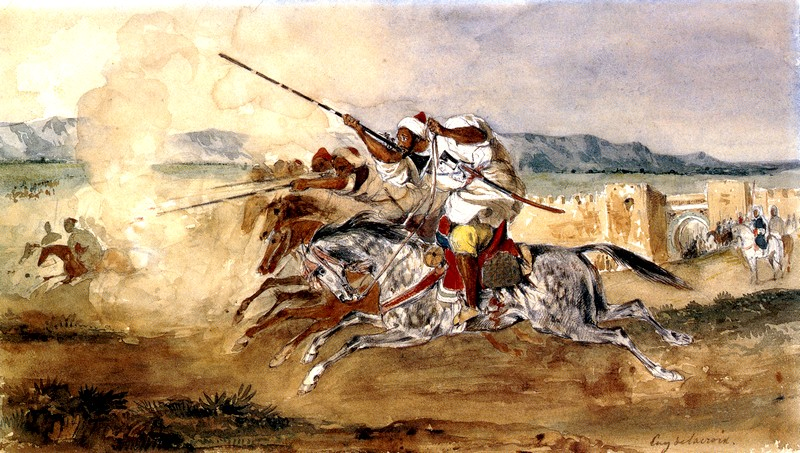

::: {.pub-item}
[Variational Approximations for Robust Bayesian Inference via Rho-Posteriors](https://arxiv.org/abs/2601.07325){.pub-title}

[El Mahdi Khribch, Pierre Alquier]{.pub-authors}

[*Preprint*]{.pub-venue}

[[arXiv](https://arxiv.org/abs/2601.07325)]{.pub-link} | [[BibTeX](files/bib/khribch2026variational.bib)]{.pub-link} | [[Google Scholar](https://scholar.google.com/scholar?q=%22Variational+Approximations+for+Robust+Bayesian+Inference+via+Rho-Posteriors%22)]{.pub-link}

The $\rho$-posterior framework provides universal Bayesian estimation with explicit contamination rates and optimal convergence guarantees, but has remained computationally difficult due to an optimization over reference distributions that precludes intractable posterior computation. We develop a PAC-Bayesian framework that recovers these theoretical guarantees through temperature-dependent Gibbs posteriors, deriving finite-sample oracle inequalities with explicit rates and introducing tractable variational approximations that inherit the robustness properties of exact $\rho$-posteriors. Numerical experiments demonstrate that this approach achieves theoretical contamination rates while remaining computationally feasible, providing the first practical implementation of $\rho$-posterior inference with rigorous finite-sample guarantees.
:::

::: {.pub-item}
[On importance sampling and independent Metropolis--Hastings with an unbounded weight function](https://arxiv.org/abs/2411.09514){.pub-title}

[George Deligiannidis, Pierre E. Jacob, El Mahdi Khribch, Guanyang Wang]{.pub-authors}

[*Major revision at The Annals of Statistics*]{.pub-venue}

[[arXiv](https://arxiv.org/abs/2411.09514)]{.pub-link} | [[BibTeX](files/bib/deligiannidis2024importance.bib)]{.pub-link} | [[Google Scholar](https://scholar.google.com/scholar?q=%22On+importance+sampling+and+independent+Metropolis-Hastings+with+an+unbounded+weight+function%22)]{.pub-link}

We study importance sampling (IS) and the particle independent Metropolis--Hastings (PIMH) algorithm when the weight function is unbounded but has finite moments of order $p$. For PIMH with $N$ particles, we establish the convergence rate
$$\left|\bar{q}P^t - \bar{\pi}\right|_{\mathrm{TV}} \leq \frac{C}{\sqrt{N}}\,\frac{1}{(1+t)^{p-1}}.$$
For the single-chain IMH, we prove that the common random numbers (CRN) coupling is maximal, yielding the exact identity
$$\left|P^t(x,\cdot) - P^t(y,\cdot)\right|_{\mathrm{TV}} = P_{x,y}(\tau > t).$$
This allows a formal comparison of the finite-time biases of IS and IMH, showing IMH to have strictly smaller bias.
:::

::: {.pub-item}
[Convergence of Statistical Estimators via Mutual Information Bounds](https://arxiv.org/abs/2412.18539){.pub-title}

[El Mahdi Khribch, Pierre Alquier]{.pub-authors}

[*Submitted and under review for Journal of Machine Learning Research*]{.pub-venue}

[[arXiv](https://arxiv.org/abs/2412.18539)]{.pub-link} | [[BibTeX](files/bib/khribch2024convergence.bib)]{.pub-link} | [[Google Scholar](https://scholar.google.com/scholar?q=%22Convergence+of+Statistical+Estimators+via+Mutual+Information+Bounds%22)]{.pub-link}

We introduce a unified mutual information bound for general statistical models, bridging PAC-Bayesian theory, Bayesian nonparametrics, and classical estimation. The bound yields sharper contraction rates for fractional posteriors and applies to a wide family of estimators including variational inference and MLE. The central inequality is
$$\mathbb{E}_{\theta\sim\hat{\rho}}\!\left[D_\alpha(P_\theta\|P_{\theta_0})\right] - \frac{\alpha}{n(1-\alpha)}\,\mathbb{E}_{\theta\sim\hat{\rho}}\!\left[r_n(\theta,\theta_0)\right] \leq \frac{\mathcal{I}(\theta,\mathcal{S})}{n(1-\alpha)},$$
where $D_\alpha$ is the Rényi divergence of order $\alpha$, $r_n$ is the log-likelihood ratio evaluated on the sample $\mathcal{S}$, and $\mathcal{I}(\theta,\mathcal{S})$ is the mutual information between the estimator and the data.
:::

```{=html}
<div class="painting-section">
  
  <div class="painting-caption">
    Eugène Delacroix, <em>Fantasia arabe</em>, 1833. Oil on canvas, Städel Museum, Frankfurt am Main.
  </div>
</div>
```
