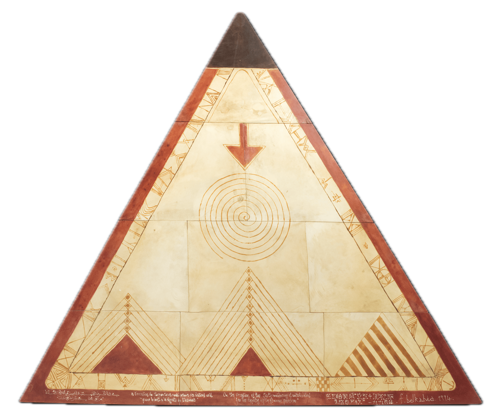

::: {.talk-item}
[**Monte Carlo and Quasi-Monte Carlo Methods (MCQMC 2026)**](https://maths.ed.ac.uk/events/mcqmc-2026) --- Contributed Talk\
Edinburgh
:::

::: {.talk-item}
[**ISBA 2026 World Meeting**](https://isba2026.github.io/) --- Poster\
Milano
:::

::: {.talk-item}
[**Fundamentals of Statistical Machine Learning (FSML) Research Group, UCL**](https://fsml-ucl.github.io/) --- Talk\
March 2026, London
:::

::: {.talk-item}
[**Computational Statistics and Machine Learning Reading Group, University of Warwick**](https://warwick.ac.uk/fac/sci/statistics/) --- Talk\
February 2026, Coventry
:::

::: {.talk-item}
[**Advances in MCMC Methods (EURANDOM)**](https://www.eurandom.tue.nl/event/methodology-and-theory-mcmc/) --- Poster\
10--12 December 2025, Eindhoven
:::

::: {.talk-item}
**ESSEC APAC--CNRS--SMU Mini-Workshop** --- Talk\
13 June 2025, Singapore
:::

::: {.talk-item}
[**Bayes Comp 2025**](https://bayescomp2025.sg/index.php#) --- Poster Session --- **Best Poster Prize**\
Singapore
:::

::: {.talk-item}
[**Bayesian Young Statisticians Meeting (BAYSM 2025)**](https://baysm2025.github.io/) --- Talk\
"Convergence of Statistical Estimators via Mutual Information Bounds"\
7--11 April 2025 (online)
:::

::: {.talk-item}
[**Bayes Comp 2023**](https://bayescomp2023.com/) --- Poster Session\
Levi, Finland
:::

```{=html}
<div class="painting-section">
  
  <div class="painting-caption">
    Farid Belkahia, <em>La dignité de l'homme</em>, henné sur peau, 248 × 289 cm, 1994.
  </div>
</div>
```
