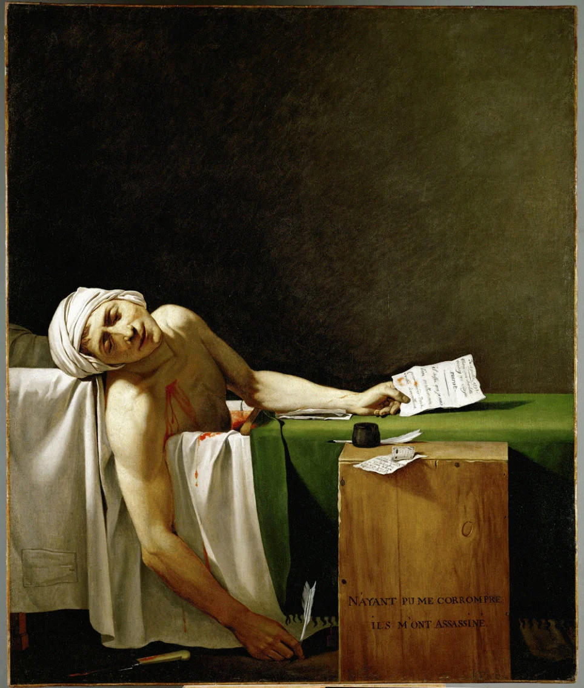

### Teaching Assistant --- [Simulation and Monte-Carlo Methods](https://www.ensae.fr/en/courses/328-simulation-and-monte-carlo-methods)
**ENSAE Paris**, 2023--2025

---

### Teaching Assistant --- [Introduction to Stochastic Processes](https://www.ensae.fr/en/courses/269)
**ENSAE Paris**, 2023--2025

---

### Teaching Assistant --- High Dimensional Statistics
**ENPC ParisTech**, 2023--2025

```{=html}
<div class="painting-section">
  
  <div class="painting-caption">
    Jacques-Louis David, <em>La Mort de Marat</em>, 1793. Oil on canvas, Musées royaux des Beaux-Arts de Belgique, Brussels.
  </div>
</div>
```
